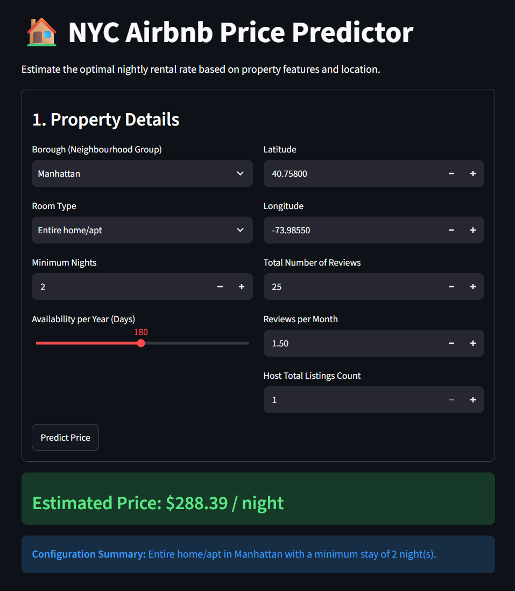

# DS605: Fundamentals of Machine Learning

## Lab Assignment - 4: End-to-End Machine Learning Project: Airbnb Price Prediction

**Student Details**
* **Name:** Manush Doshi
* **Student ID:** 202618028
* **Dataset:** Kaggle New York City Airbnb Open Data (`AB_NYC_2019.csv`)
* **Live Application:** https://airbnb-priceprediction-ds605.streamlit.app/

---

### 🎯 Objective
The objective of this assignment is to build a complete machine learning workflow for predicting Airbnb prices and to make the final model usable through a simple, deployed web application. 

---

### Task 1: Data Analysis and Preparation
* **Data Cleaning & Outlier Handling:** Analyzed the dataset and removed extreme price outliers (limiting the target variable between >$0 and <=$1000) to capture realistic market trends.
* **Feature Transformation:** Applied a log transformation (`np.log1p`) to the highly right-skewed `price` variable to normalize it for linear and tree-based modeling.
* **Feature Selection & Engineering:** Dropped high-cardinality, non-predictive columns (`id`, `name`, `host_name`) to reduce noise. 
* **Preprocessing Pipeline:** Handled missing values and transformed the features using a Scikit-learn `ColumnTransformer`—applying `StandardScaler` for numerical attributes and `OneHotEncoder(handle_unknown='ignore')` for categorical groupings.

### Task 2: Model Training and Evaluation
* **Model Comparison:** Trained and compared suitable regression models including Ridge Regression, Random Forest, and Gradient Boosting to establish baseline performances. 
* **Hyperparameter Tuning:** Selected Gradient Boosting as the primary model and performed hyperparameter tuning using 3-fold cross-validation across 10 candidates.
* **Evaluation & Overfitting Check:** Evaluated the final model using standard regression metrics on a real-dollar scale:
  * **Training Set:** RMSE: $77.75 | MAE: $39.70 | R²: 0.5537
  * **Testing Set:** RMSE: $87.84 | MAE: $45.23 | R²: 0.4470
  * *Note:* The variance between train and test scores indicates a moderate, acceptable level of overfitting typical for tree-based ensemble methods.
* **Pipeline Serialization:** Saved the complete, fitted preprocessing workflow and regressor as `airbnb_price_pipeline.joblib` for processing new inputs.

### Task 3: Streamlit Application
* **Web Interface:** Built an interactive Streamlit interface that accepts realistic NYC Airbnb listing parameters (e.g., location, room type, availability).
* **Inference Pipeline:** The app routes the raw inputs through the loaded `.joblib` pipeline and returns an estimated nightly price in real-time.
* **Deployment:** Tested the application successfully with realistic inputs and deployed it online to Streamlit Community Cloud.

### Task 4: Final Project Summary
* **Main Analysis:** The geographic spatial analysis and model feature importances confirm that physical location (`longitude`/`latitude`) and `room_type` are the dominant variables influencing nightly pricing in NYC.
* **Model Performance & App Results:** The final Gradient Boosting model efficiently estimates prices for standard listings, achieving an R² of 0.4470 on unseen data. The Streamlit app provides an intuitive, instant pricing tool based on these findings.
* **System Limitations:** The primary limitation is heteroscedasticity at the higher end of the market. The model struggles to accurately predict luxury penthouses because premium pricing relies on factors not present in the dataset (e.g., interior design, luxury amenities, views).

---

### 📊 Key Visualizations & Screenshots

**1. Application Screenshot**
*(Below is the deployed Streamlit user interface)*

**2. Geographic Spatial Map**
*(Demonstrates listing clusters across NYC boroughs)*

**3. Feature Importances**
*(Top variables influencing the Gradient Boosting model)*

**4. Actual vs. Predicted Prices**
*(Visualizing prediction accuracy and variance)*
